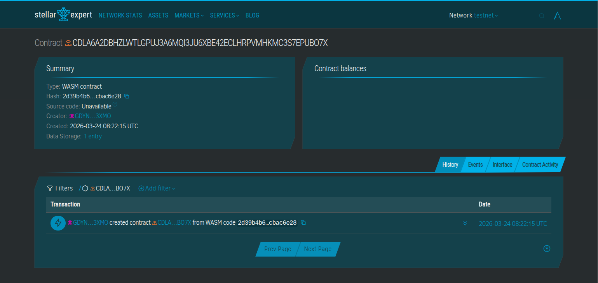
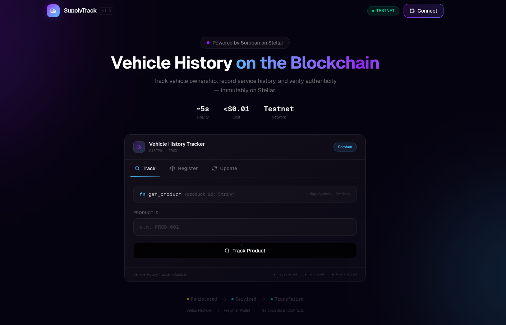

# 🚗 Vehicle History Tracker

> A tamper-proof vehicle history ledger built on **Stellar** using **Soroban** smart contracts.

---

## 📖 Project Description

The **Vehicle History Tracker** is a decentralised application that records the complete lifecycle of a vehicle on the Stellar blockchain. Every service, accident, ownership transfer, and mileage milestone is permanently stored on-chain — immutable, transparent, and verifiable by anyone with the VIN.

Traditional vehicle history services (Carfax, AutoCheck) are centralised databases that can be manipulated, selectively disclosed, or simply wrong. This contract makes fraud structurally impossible: no one can delete a record, roll back mileage, or forge an ownership chain.





---

## 🔍 What It Does

| Action | Who can call it | Description |
|---|---|---|
| `initialize` | Deployer | Sets the contract admin on first deploy |
| `register_vehicle` | Vehicle owner | Registers a new VIN with metadata on-chain |
| `add_history_event` | Owner or Admin | Appends a service/accident/note to the VIN's log |
| `transfer_ownership` | Current owner | Transfers the vehicle to a new wallet address |
| `mark_stolen` | Admin only | Flags a VIN as stolen — blocks transfers |
| `clear_stolen` | Admin only | Clears the stolen flag (e.g. vehicle recovered) |
| `get_vehicle` | Anyone | Returns core metadata for a VIN |
| `get_history` | Anyone | Returns the full event log for a VIN |
| `get_event` | Anyone | Returns a single event by index |
| `is_stolen` | Anyone | Quick boolean stolen-status check |
| `total_events` | Anyone | Returns the total event count for a VIN |

---

## ✨ Features

* **🔒 Tamper-proof records** — All history events are append-only. Nothing is ever deleted.
* **📈 Mileage fraud detection** — The contract enforces monotonically increasing mileage. Any attempt to record a lower odometer reading than the previous entry is rejected on-chain.
* **🔑 Role-based access** — Only the current owner (or the contract admin) can add events. Ownership is cryptographically enforced via Stellar wallet signatures.
* **🚨 Stolen vehicle flag** — Authorities or admin can mark a VIN as stolen, which automatically blocks ownership transfers until cleared.
* **👤 Full ownership chain** — Every transfer records both the previous and new owner with an on-chain timestamp, creating an unbroken provenance trail.
* **⚡ Cheap & fast** — Built on Stellar, which settles in ~5 seconds with sub-cent transaction fees.
* **🌐 Permissionless reads** — Anyone can query a vehicle's history without a wallet or fees.
* **🧪 Fully tested** — Six unit tests covering the happy path and all major error conditions.

---

## 🛠️ Tech Stack

| Layer | Technology |
|---|---|
| Blockchain | [Stellar](https://stellar.org) |
| Smart Contract Runtime | [Soroban](https://soroban.stellar.org) |
| Smart Contract Language | Rust (`no_std`) |
| SDK | `soroban-sdk v21` |
| Frontend | Next.js (TypeScript) |
| Testing | Soroban test utilities (`mock_all_auths`) |

---

## 📂 Project Structure

```
vehicle-history-tracker/
├── contract/               # Soroban smart contract (Rust)
│   ├── Cargo.toml          # Rust project manifest & Soroban dependencies
│   └── src/
│       └── lib.rs          # Full smart contract + unit tests
├── client/                 # Next.js frontend (TypeScript)
│   ├── src/
│   ├── public/
│   ├── package.json
│   └── next.config.ts
├── .gitignore
└── README.md
```

---

## 🚀 Getting Started

### Prerequisites

```bash
# Install Rust
curl --proto '=https' --tlsv1.2 -sSf https://sh.rustup.rs | sh

# Add the WASM compilation target
rustup target add wasm32-unknown-unknown

# Install the Stellar CLI
cargo install --locked stellar-cli --features opt

# Install Node.js (v18+ recommended) for the frontend
# https://nodejs.org
```

---

### 📦 Smart Contract

#### Build

```bash
cd contract

# Compile to WASM
stellar contract build
```

The optimised `.wasm` binary will appear at:

```
target/wasm32-unknown-unknown/release/vehicle_history_tracker.wasm
```

#### Run Tests

```bash
cargo test
```

Expected output:

```
running 6 tests
test tests::test_register_and_get            ... ok
test tests::test_add_history_event           ... ok
test tests::test_ownership_transfer          ... ok
test tests::test_stolen_flag                 ... ok
test tests::test_double_registration_fails   ... ok
test tests::test_decreasing_mileage_rejected ... ok

test result: ok. 6 passed; 0 failed
```

#### Deploy to Testnet

```bash
# Generate a deployer keypair
stellar keys generate deployer --network testnet

# Fund it via Friendbot
stellar keys fund deployer --network testnet

# Deploy
stellar contract deploy \
  --wasm target/wasm32-unknown-unknown/release/vehicle_history_tracker.wasm \
  --source deployer \
  --network testnet

# Initialise (replace ADMIN_ADDRESS and CONTRACT_ID)
stellar contract invoke \
  --id CONTRACT_ID \
  --source deployer \
  --network testnet \
  -- initialize \
  --admin ADMIN_ADDRESS
```

---

### 🖥️ Frontend (Client)

The `client/` directory contains a **Next.js** frontend that lets users register vehicles, view history, and interact with the smart contract through a browser using the [Freighter](https://www.freighter.app/) Stellar wallet.

#### Install dependencies

```bash
cd client
npm install
```

#### Set up environment variables

Create a `.env.local` file in the `client/` directory:

```env
NEXT_PUBLIC_CONTRACT_ID=CDLA6A2DBHZLWTLGPUJ3A6MQI3JU6XBE42ECLHRPVMHKMC3S7EPUBO7X
NEXT_PUBLIC_NETWORK=testnet
NEXT_PUBLIC_RPC_URL=https://soroban-testnet.stellar.org
```

#### Run locally

```bash
npm run dev
```

The app will be available at `http://localhost:3000`.

#### Build for production

```bash
npm run build
npm start
```

---

## 📡 Example Contract Interactions

### Register a vehicle

```bash
stellar contract invoke \
  --id CONTRACT_ID --source owner --network testnet \
  -- register_vehicle \
  --owner OWNER_ADDRESS \
  --vin  "1HGCM82633A123456" \
  --make "Honda" --model "Accord" --year 2020
```

### Add a service record

```bash
stellar contract invoke \
  --id CONTRACT_ID --source owner --network testnet \
  -- add_history_event \
  --caller      OWNER_ADDRESS \
  --vin         "1HGCM82633A123456" \
  --event_type  "SERVICE" \
  --description "Oil change, brake inspection" \
  --mileage     45230
```

### Check if stolen

```bash
stellar contract invoke \
  --id CONTRACT_ID --network testnet \
  -- is_stolen --vin "1HGCM82633A123456"
```

### View full history

```bash
stellar contract invoke \
  --id CONTRACT_ID --network testnet \
  -- get_history --vin "1HGCM82633A123456"
```

---

## 🗺️ Roadmap

* Multi-party inspection reports (mechanic signs with their own wallet)
* IPFS attachment hashes (store repair photos off-chain, anchor hash on-chain)
* Recall notices linked to VIN patterns
* Frontend dApp (React + Freighter wallet integration)
* Insurance integration via cross-contract calls

---

## 🔗 Deployed Smart Contract

**Network:** Stellar Testnet  
**Contract ID:** `CDLA6A2DBHZLWTLGPUJ3A6MQI3JU6XBE42ECLHRPVMHKMC3S7EPUBO7X`  
**Explorer:** https://stellar.expert/explorer/testnet/contract/CDLA6A2DBHZLWTLGPUJ3A6MQI3JU6XBE42ECLHRPVMHKMC3S7EPUBO7X

---

## 📄 License

MIT — see [LICENSE](./LICENSE) for details.
